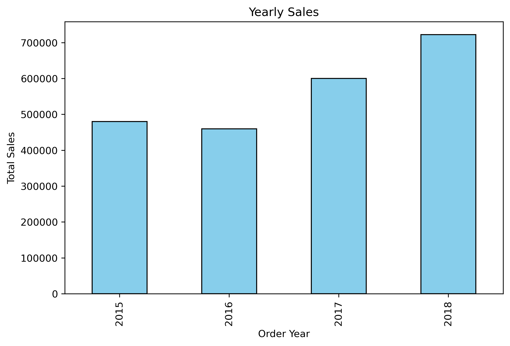
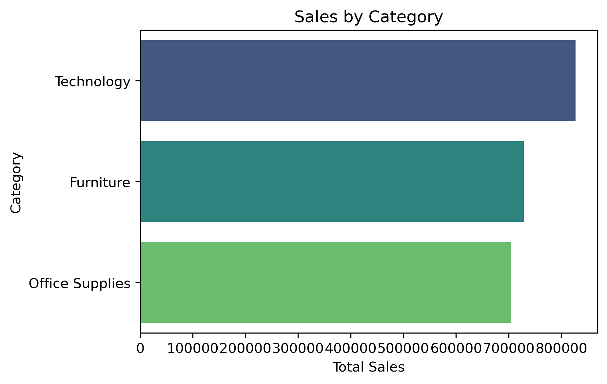

# 🏬 Superstore Sales Analysis  

## 📌 Project Overview  
This project analyzes a **Superstore dataset** to uncover insights about sales trends, customer segments, product categories, and delivery performance.  
The goal is to perform **Exploratory Data Analysis (EDA)** and generate meaningful business insights with visualizations.  

---

## 📂 Dataset  
- Source: Superstore sales dataset (CSV file)  
- Key Columns:  
  - `Order Date`, `Ship Date`  
  - `Sales`, `Category`, `Sub-Category`  
  - `Region`, `Segment`  
  - Derived column: `Delivery Days`  

---

## 🔍 Analysis & Insights  

### 1. 📈 Yearly Sales Trend  
- **Highest Sales Year:** 2017  
  

### 2. 🗓 Monthly Sales Trend  
- Sales peak towards **end of the year**.  
  

### 3. 🏷 Sales by Category  
- **Technology** leads in sales.  
  

### 4. 📦 Sales by Sub-Category  
- **Phones & Chairs** dominate sales.  
  

### 5. 🌍 Sales by Region  
- **West region** contributes the most.  
  

### 6. 👥 Sales by Segment  
- **Consumer segment** is the largest.  
  

### 7. 🚚 Delivery Days Analysis  
- Most orders are delivered within **2–5 days**.  
  

---

## 🚀 How to Run  
1. Clone the repository  
```bash
git clone https://github.com/your-username/superstore-analysis.git
cd superstore-analysis
